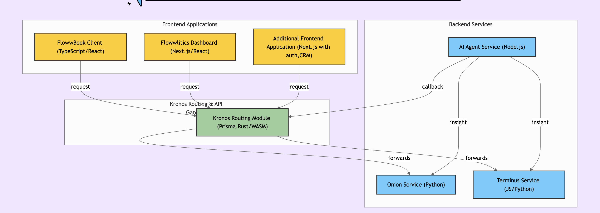

# 🚀 Flowwbook & Flowwlitics


Welcome to our Hackfest 2025 project!

**Flowwbook** is a next-generation closed-space community platform crafted for workplaces. It enables team communication, anonymous posting, intelligent insights, and organizational engagement in a seamless interface.

**Flowwlitics** is a powerful HR analytics dashboard that draws insights from Flowwbook data, helping organizations make better people decisions using AI/ML-enhanced metrics.



---

## 🧠 Project Overview

### 🔹 Flowwbook (Frontend)

- Built with **TypeScript + React**
- A social space for employees
- Features:
  - Anonymous posts
  - AI prompts & replies
  - Secure login system
- Connects to backend via the **Kronos Routing Module**

### 🔹 Flowwlitics (Frontend)

- Built with **Next.js + React**
- HR Dashboard to analyze:
  - Engagement trends
  - Anonymous sentiment feedback
  - Team health indicators
- Fetches insights from Flowwbook backend

### 🔹 Backend Services

- **Kronos Routing Module**  
  Built with **Rust/WASM + Prisma**, it acts as the API gateway and orchestrator of all services.

- **AI Agent Service (Node.js)**  
  Handles user prompts, generates AI responses, and calls external AI APIs.

- **Onion Service (Python)**  
  Natural Language Processing (NLP) module to extract sentiment, topic analysis, etc.

- **Terminus Service (JS/Python)**  
  Final transformation and insight delivery layer; integrates into Flowwlitics.

---

## 🛠 Tech Stack

| Component      | Tech Stack         |
| -------------- | ------------------ |
| Flowwbook      | TypeScript, React  |
| Flowwlitics    | Next.js, React     |
| Routing Module | Rust, WASM, Prisma |
| AI Service     | Node.js            |
| NLP Service    | Python             |
| Data Service   | JS, Python         |
| Database       | PostgreSQL         |

---

## 🧩 Folder Structure

```
floww-hackfest/
├── apps/
│   ├── flowwbook/           # Frontend for users
│   └── flowwlitics/         # Frontend for HR analytics
├── services/
│   ├── ai-agent/            # Node.js based AI response module
│   ├── onion-service/       # NLP processor in Python
│   ├── terminus-service/    # Final insights layer
│   └── kronos-routing/      # Rust routing module
└── README.md
```

---

## 📦 Local Setup Instructions

### ✅ Prerequisites

- Node.js (v18+)
- Rust
- Python 3.10+
- PostgreSQL
- Docker (optional)
- pnpm / yarn / npm

---

### 🔃 1. Clone the Repository

```bash
git clone https://github.com/yourusername/floww-hackfest.git
cd floww-hackfest
```

---

### ⚙️ 2. Setup Environment Variables

Create `.env` files inside:

#### `/apps/flowwbook/.env` & `/apps/flowwlitics/.env`

```env
NEXT_PUBLIC_API_BASE=http://localhost:8080
AUTH_SECRET=your_super_secret_key
```

#### `/services/kronos-routing/.env`

```env
DATABASE_URL=postgresql://localhost:5432/flowwbook
AI_AGENT_URL=http://localhost:5001
ONION_SERVICE_URL=http://localhost:5002
TERMINUS_SERVICE_URL=http://localhost:5003
```

---

### 📥 3. Install Dependencies

#### Node-based apps:

```bash
cd apps/flowwbook && pnpm install
cd ../flowwlitics && pnpm install
cd ../../services/ai-agent && pnpm install
```

#### Rust (Kronos):

```bash
cd services/kronos-routing
cargo build
```

#### Python services:

```bash
cd services/onion-service
pip install -r requirements.txt

cd ../terminus-service
pip install -r requirements.txt
```

---

### 🚀 4. Start All Services

#### Option A: Manual Mode (Split terminals)

```bash
# Terminal 1
cd apps/flowwbook && pnpm dev

# Terminal 2
cd apps/flowwlitics && pnpm dev

# Terminal 3
cd services/ai-agent && pnpm start

# Terminal 4
cd services/onion-service && python main.py

# Terminal 5
cd services/terminus-service && python main.py

# Terminal 6
cd services/kronos-routing && cargo run
```

---

### 🐘 5. Run Database with Docker (Optional)

```bash
docker run --name flowwbook-db \
  -e POSTGRES_PASSWORD=admin \
  -e POSTGRES_DB=flowwbook \
  -p 5432:5432 -d postgres
```

---

## 🧪 Demo Credentials

```text
Email:    demo@company.com
Password: floww123
```

---

## 🧭 Future Enhancements

- [ ] Role-based access & Admin tools
- [ ] Slack/Teams integrations
- [ ] Sentiment-aware AI Nudges
- [ ] Daily summaries for managers
- [ ] Multilingual NLP support

---

## 🙌 Contributors

- **Prasad Patra** – Team lead, backend architecture
- **Rakshit Singh** – ML integration, backend support
- **Nishkarsh Gupta** – UI/UX wireframing and design
- **Sanat Behera** – Integration with ATOM HR (Flowwlitics)
- **Sonali Lipsa Patra** – Data analytics, product-market fit

---

## 🏁 License

MIT License. Free to use, remix, and build on.

---

Made with ❤️ at **Hackfest 2025**
